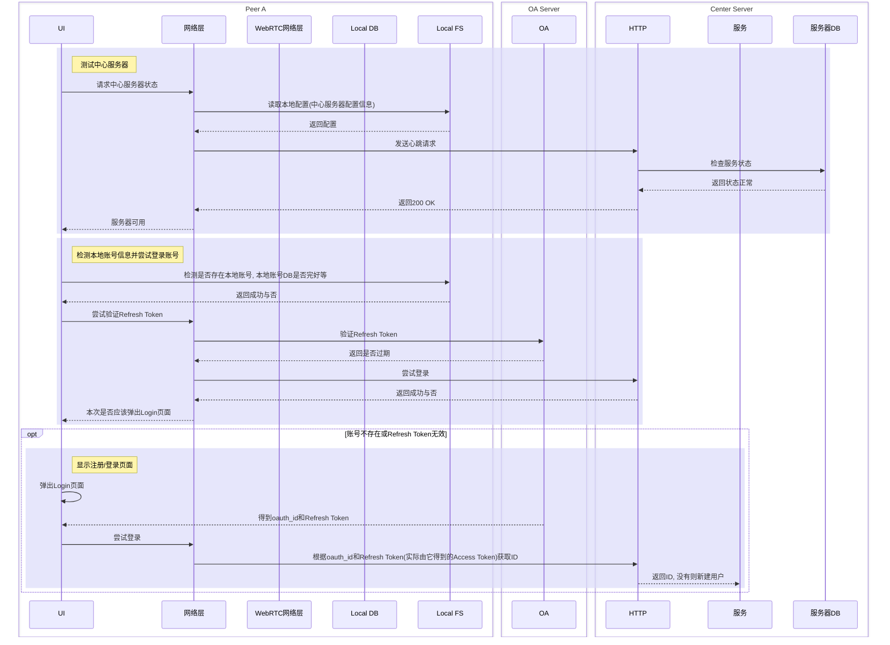

# 设计文档

## 参考&原型

## 核心概念

- Client: 正在运行的App
- Server: 一般指中心服务器(含信令服务器)
- User: 通过ID区分
- Peer: 一个WebRTC连接节点, 一个用户可以是多个Peer
- Session: 一次P2P的WebRTC会话, 参与者是两个Peer; 两个Peer间可以有多个Session

## 基本工作流程(从0开始)

### 先决条件

1. 中心服务器(无任何信息)
2. OA服务器
3. 至少2个Peer(尚未建立账户)

### 流程时序图

## 登录与鉴权

使用第三方OA(Logto等), 通过oauth_id(OA的永久唯一标识符)得到唯一用户ID(未注册则新建)

## Client

### UI

#### 页面层级

- Login
- Chat List
- Group Messages
- Contacts
- Settings

### 数据库

#### 设计原则

1. 一个Group Chat中所有Member(User)的聊天记录表是一样的;
2. 

### 网络

## Server

## 需要考虑的问题

