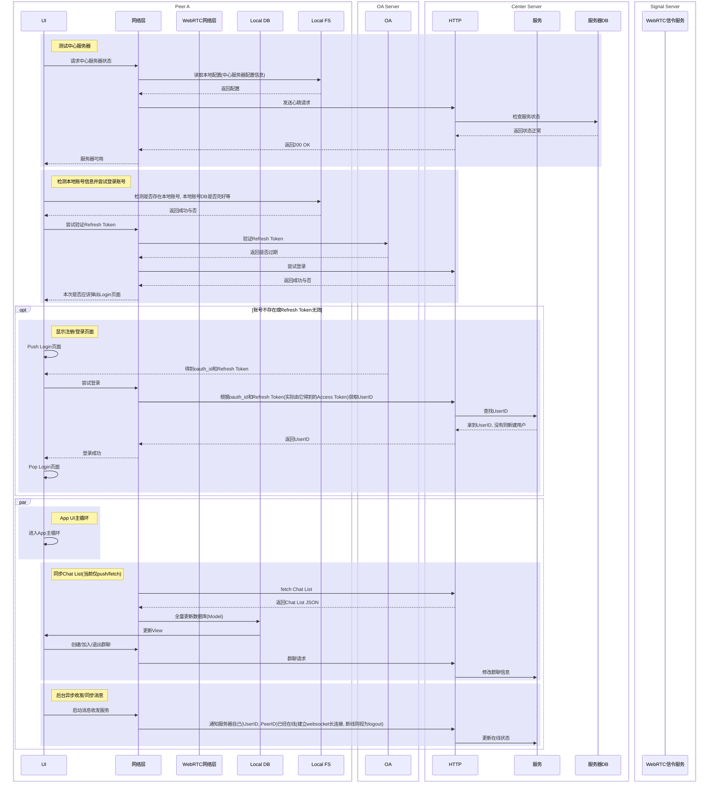

# 设计文档

## 参考&原型

## 核心概念

- Client: 正在运行的App
- Server: 一般指中心服务器(含信令服务器)
- User: 通过UserID区分
- Peer: 一个WebRTC连接节点, 一个用户可以是多个Peer(即设备), 通过PeerID区分
- Session: 一次P2P的WebRTC会话, 参与者是两个Peer; 两个Peer间可以有多个Session

## 当前简化

- 不管鉴权, 只管注册和登录
- 不考虑用户多设备登录(即一个UserID唯一对应一个PeerID)
- 消息收发使用广播的方式

## 基本工作流程(从0开始)

### 先决条件

1. 中心服务器(无任何信息)
2. OA服务器
3. 至少2个Peer(尚未建立账户)

### 流程时序图



## 登录与鉴权

使用第三方OA(Logto等), 通过oauth_id(OA的永久唯一标识符)得到唯一用户UserID(未注册则新建)

## Client

### UI

#### 页面层级

- Login
- Chat List
- Group Messages
- Contacts
- Settings

### DataModel

- Chat List
    - 与中心服务器数据交换:
    ```json
    [
        {
            "group_id": 0, // 全局唯一
            "group_name": "",
            "members": [
                {
                    "user_id": 0, // 全局唯一
                    "user_name": "",
                    "online": false
                }
            ],
            "type": "GROUP_CHAT|PRIVATE_CHAT|BOT" 
        }
    ]
    ```
- Contacts
    - 与中心服务器数据交换:
    ```json
    [
        {
            "user_id": 0,
            "user_name": "",
            "online": false,
            "group": "unimplemented" // 联系人分分组, 未实现
        }
    ]
    ```
- User Info
    - 与中心服务器数据交换:
    ```json
    {
        "user_name": "",
        // 一个User可以有多个peer(多设备)
        "devices": [
            {
                "peer_id": 0, // 全局唯一
                "description": "unimplemented", //设备友好名称, 未实现
                "online": false,
                "sessions": [ 0, 1, 2 ] // 两个peer间可以有多个session, 在client webrtc层通过session_id区分, session_id全局唯一
            }
        ]
    }
    ```
- Group Messages
    ```sql

    ```
- Settings
    - 仅Client使用
    ```json
    {
        "webrtc": {
            "iceServers": [
                {
                    "urls": [
                        "stun:stun.l.google.com:19302",
                        "stun:stun.l.google.com:5349"
                    ]
                },
                {
                    "urls": [
                        "turn:relay1.expressturn.com:3478"
                    ],
                    "username": "efARMECFO0KUN06AGV",
                    "credential": "3PSJgUoRo0lIU8aH"
                }
            ]
        },
        "signalServer": {
            "host": "0.0.0.0",
            "port": "8080",
            "useSsl": false
        },
        "chatServer": {
            "host": "0.0.0.0",
            "port": "8080",
            "useSsl": false
        }
    }
    ```
#### 设计原则

1. 一个Group Chat中所有Member(User)的聊天记录表是一样的;
2. 

### 网络

## Server

## 需要考虑的问题


